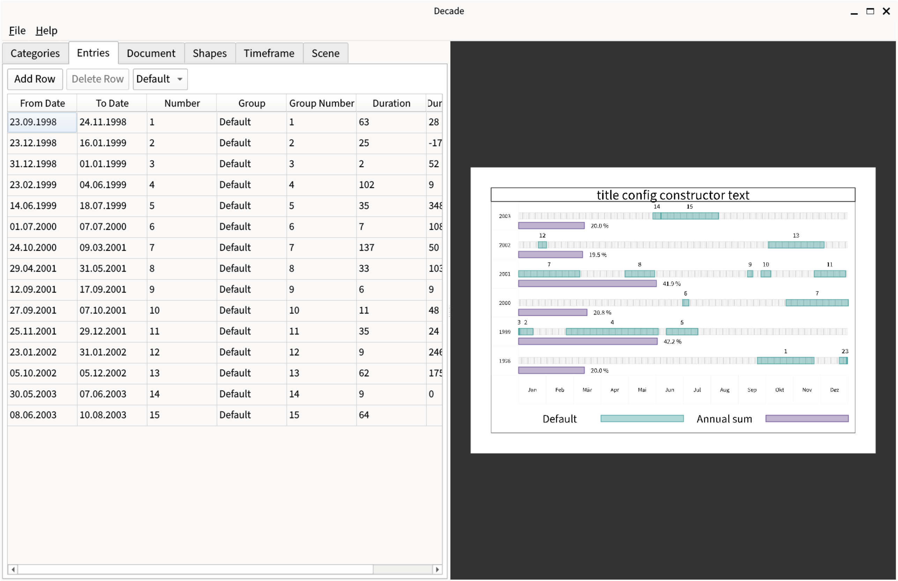
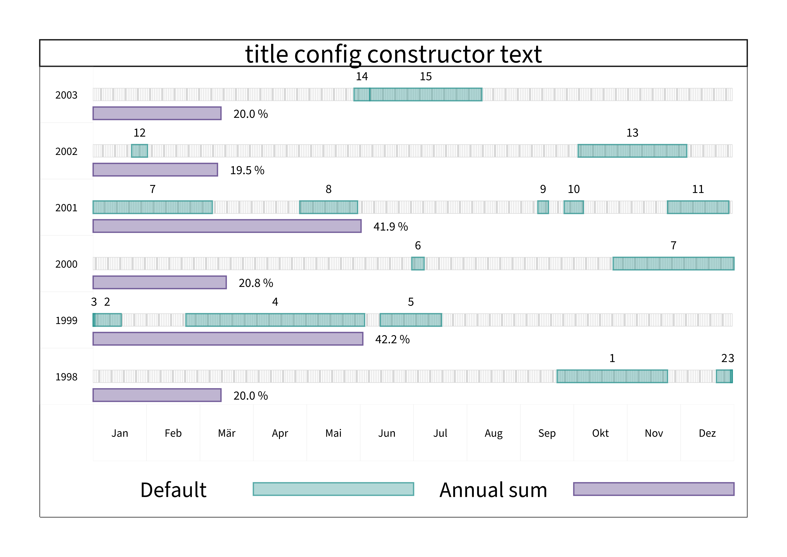

# decade

Desktopanwendung, die Zeiträume über mehrere Jahre auf einer Kalenderseite darstellt — eine Zeile pro Jahr, darunter die Jahressumme. Die Seite lässt sich als PNG exportieren; Daten kommen aus CSV, ganze Projekte aus XML.

Alpha-Stand, aus einem Übungsprojekt gewachsen. C++23, wxWidgets, OpenGL, ICU.

Bauen, starten, Tests und die kopflosen Läufe stehen in [betrieb.md](betrieb.md); Architektur und Konventionen in [AGENTS.md](AGENTS.md).

## Zweck

### Oberfläche

Links die Eingabetabellen und Einstellungen, rechts die gerenderte Seite:

### Export

Dieselbe Seite als PNG-Export in Druckauflösung:

